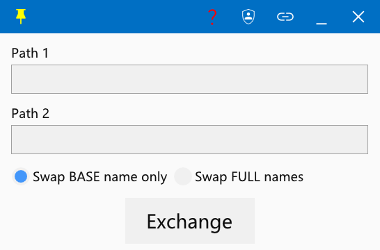

# name_exchanger (C++)

Language: [简体中文 / 繁體中文](./README.md) | English

A lightweight Windows utility to swap names between two files or directories (C++ + ImGui).

## Features

- Drag and drop 1 or 2 files/folders, or type paths manually.
- Two swap modes:
  - Preserve extensions (swap base names only)
  - Swap full names (including extensions)
- System tray support:
  - Left-click: show/hide window
  - Right-click: exit
- Always-on-top toggle.
- Create/remove Send To shortcut:
  - Left-click: create
  - Right-click: remove
- Administrator mode toggle.

## Command Line Usage

```text
name_exchanger <path1> <path2> [preserve]
```

- `preserve` is optional and defaults to `true`.
- Value `false` would swap full names.
- Value `true` would swap basename only without changing extensions.

## Screenshot



## Library

- [exchange_name_lib](https://github.com/Mikachu2333/exchange_name_lib)
