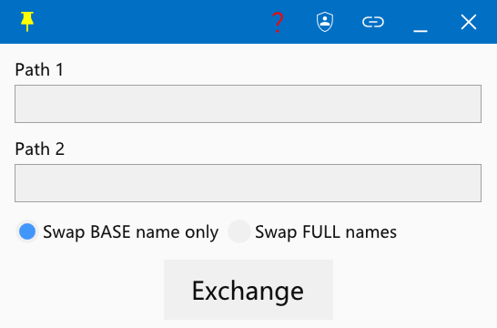

# name_exchanger (C++)

Language: [简体中文 / 繁體中文](./README.md) | **English**

A lightweight Windows utility to swap names between two files or directories (C++ + ImGui).

## Features

- Supports dragging and dropping 1 or 2 files/folders, as well as manual path input.
- Two swap modes:
  - Preserve extensions (swaps base names only)
  - Swap full names (including extensions)
- System tray support: left-click to show/hide the window, right-click to exit.
- Always-on-top toggle.
- Create/remove "Send To" shortcut (left-click to create, right-click to remove).
- Administrator mode toggle.

## Command Line Usage

```text
name_exchanger <path1> <path2> [preserve]
```

- `preserve` is an optional parameter, defaulting to `true` (preserves extensions). Can be set to `false` (swaps full file names).

## Other Notes

- Supports Windows 7 and above.
- Supports special paths like mounted virtual directories, network drives, and WSL paths.
- Automatically reverts and provides a notification on swap failure.
- Some special directories may require specific permissions; please use with caution.

## Screenshot



## Related Library

- [exchange_name_lib](https://github.com/Mikachu2333/exchange_name_lib)
