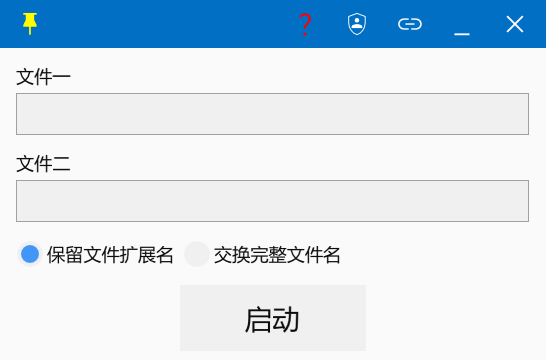
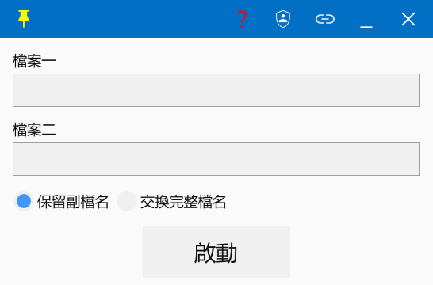

# name_exchanger (C++)

语言：中文（默认） | [English](./README.en.md)

## 简体中文

一个用于交换两个文件或目录名称的 Windows 小工具（C++ & ImGui）。

### 主要功能

- 支持拖入 1 个或 2 个文件/文件夹，也支持手动输入路径。
- 支持两种交换模式：
  - 保留扩展名（仅交换主文件名）
  - 完整交换文件名（包含扩展名）
- 支持托盘常驻：左键显示/隐藏窗口，右键退出。
- 支持窗口置顶。
- 支持创建/删除“发送到”快捷方式（左键创建，右键删除）。
- 支持切换管理员权限。

<!-- test -->

- 支援拖入 1 個或 2 個檔案/資料夾，也支持手動輸入路徑。
- 支援兩種交換模式：
  - 保留副檔名（僅交換主檔名）
  - 完整交換檔名（包含副檔名）
- 支援任務欄常駐：左鍵顯示/隱藏視窗，右鍵退出。
- 支援視窗置頂。
- 支援新增/刪除“傳送到”快捷方式（左鍵新增，右鍵刪除）。
- 支援切換管理員權限。

### 命令行用法

```text
name_exchanger <path1> <path2> [preserve]
```

`preserve` 为可选参数，默认 `true`（保留扩展名），可选 `false`（完整交换文件名）。
<!-- test -->
`preserve` 為可選參數，默認 `true`（保留副檔名），可選 `false`（完整交換檔名）。

### 截图

|简体|繁體|
|---|---|
|||

### 相关库

- [exchange_name_lib](https://github.com/Mikachu2333/exchange_name_lib)
