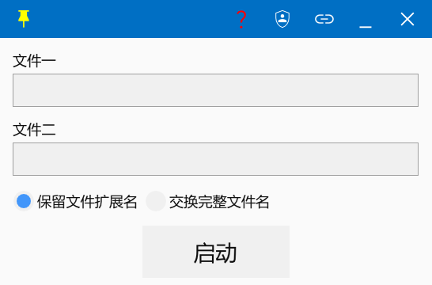
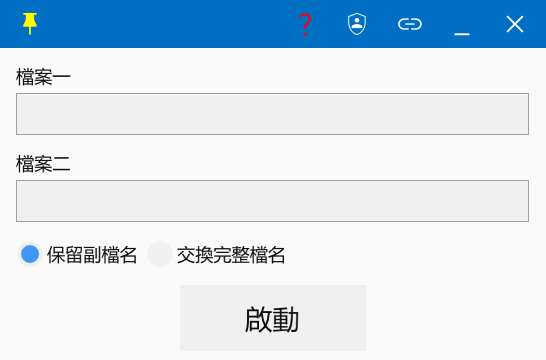

# name_exchanger (C++)

语言：**中文** | [English](./README.en.md)

## 简介

一个用于交换两个文件或目录名称的 Windows 小工具（C++ & ImGui）。

### 主要功能

- 支持拖入 1 个或 2 个文件/文件夹，也支持手动输入路径。
- 支持两种交换模式：
  - 保留扩展名（仅交换主文件名）
  - 完整交换文件名（包含扩展名）
- 支持托盘常驻：左键显示/隐藏窗口，右键退出。
- 支持窗口置顶。
- 支持创建/删除“发送到”快捷方式（左键创建，右键删除）。
- 支持切换管理员权限。

------

- 支援拖入 1 個或 2 個檔案/資料夾，也支持手動輸入路徑。
- 支援兩種交換模式：
  - 保留副檔名（僅交換主檔名）
  - 完整交換檔名（包含副檔名）
- 支援任務欄常駐：左鍵顯示/隱藏視窗，右鍵退出。
- 支援視窗置頂。
- 支援新增/刪除“傳送到”快捷方式（左鍵新增，右鍵刪除）。
- 支援切換管理員權限。

### 命令行用法

```text
name_exchanger <path1> <path2> [preserve]
```

`preserve` 为可选参数，默认 `true`（保留扩展名），可选 `false`（完整交换文件名）。
`preserve` 為可選參數，默認 `true`（保留副檔名），可選 `false`（完整交換檔名）。

## 其它说明

- 支持 Windows 10 1607 及以上版本
- 支持库及底层文件系统允许重命名的本地、网络或虚拟路径
- 每一步重命名是原子的，但完整交换由三步组成，并非崩溃安全的事务
- 普通失败会尝试回滚；若操作与回滚均失败，程序会明确警告并要求人工检查
- 两个条目及临时目录必须位于允许重命名的同一文件系统范围内

------

- 支援 Windows 10 1607 及以上版本
- 支援程式庫及底層檔案系統允許重新命名的本機、網路或虛擬路徑
- 每一步重新命名是原子的，但完整交換由三步組成，並非崩潰安全的交易
- 一般失敗會嘗試回復；若操作與回復均失敗，程式會明確警告並要求人工檢查
- 兩個項目及暫存目錄必須位於允許重新命名的同一檔案系統範圍內

## 截图

|简体|繁體|
|---|---|
|||

## 相关库

- [exchange_name_lib](https://github.com/Mikachu2333/exchange_name_lib)
